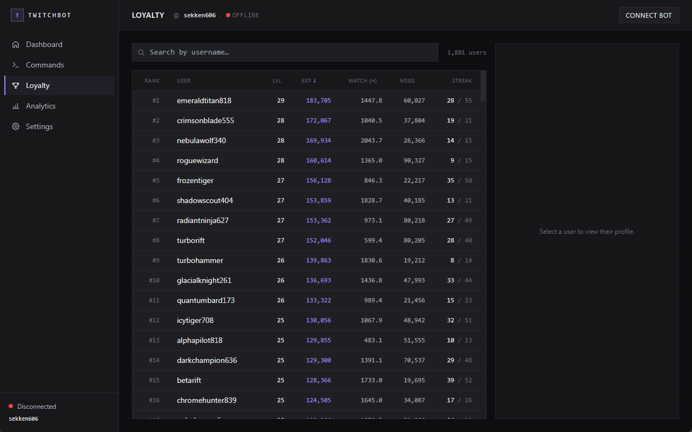
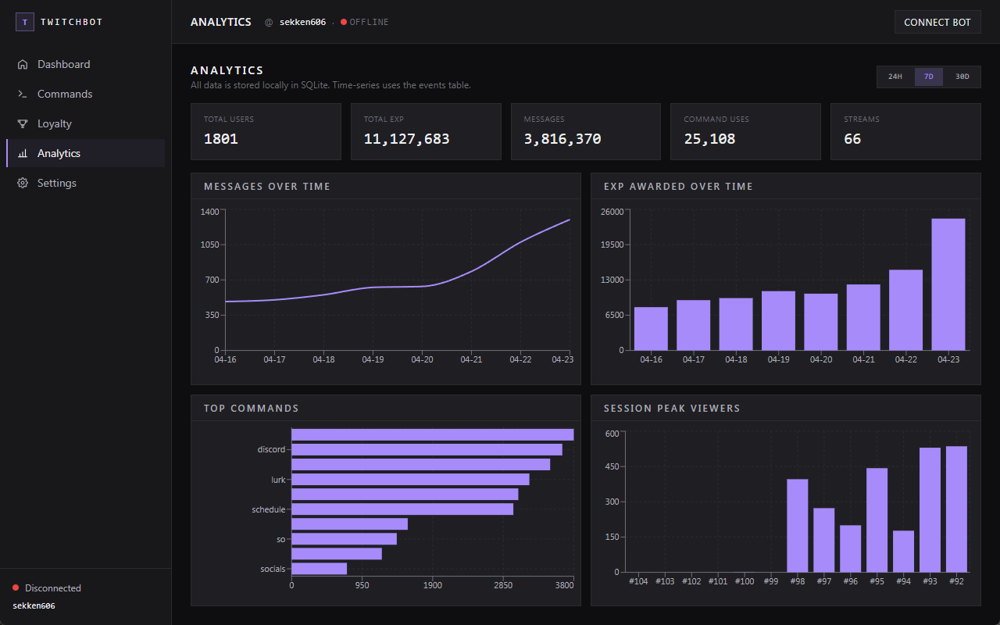
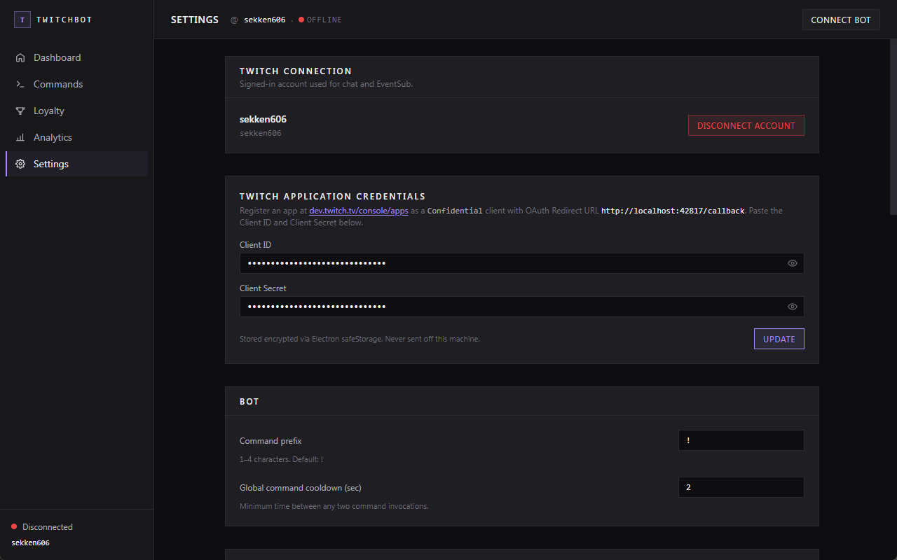

# TwitchBot

**A local Twitch bot with a loyalty system — runs on your machine, owns no data but yours.**

Chat commands, EXP and levels, watch streaks, a live event feed, and a dashboard for the analytics nerd in you. No cloud. No accounts. No subscriptions. Just an app on your PC that talks to Twitch directly.


---

## What it does

- **Runs your bot.** Connects to your Twitch chat and responds to commands — custom ones you write plus 5 built-ins (`!rank`, `!leaderboard`, `!streak`, `!watchtime`, `!commands`).
- **Tracks loyalty.** Every viewer who chats accrues EXP, levels up, and builds a watch streak across streams.
- **Shows you what happened.** A live feed mirrors chat + every follow, sub, cheer, raid, and stream event as they happen. Historical data is charted on the Analytics page.
- **Keeps your data yours.** Everything lives in a single SQLite file on your machine. You can export it at any time. Zero telemetry, zero third-party servers.

## Screens

### Commands

Custom responses with variables (`{user}`, `{level}`, `{watch_time}`, …), per-command cooldowns, and set-based permissions (any mix of `everyone`, `follower`, `vip`, `subscriber`, `moderator`).


### Loyalty & leaderboard

Sortable, searchable table of every tracked viewer. Click any user to see their profile, full event history, and admin controls (adjust EXP, reset stats).



### Analytics

Messages over time, EXP awarded per day, top-used commands, and peak viewers across past streams. All four charts update live and support 24h / 7d / 30d ranges.



### Settings

Every knob — EXP per event, level formula, streak rules, the level-up announcement template — is editable at runtime. Credentials live here too, encrypted on disk.



---

## Quick start

### 1. Register a Twitch application

You need your own app on Twitch (takes 2 minutes) — this app doesn't ship with one because credentials can't safely be shared.

1. Sign in at [dev.twitch.tv/console/apps](https://dev.twitch.tv/console/apps) → **Register Your Application**.
2. Fill in:
   - **OAuth Redirect URL:** `http://localhost:42817/callback` (exact match, port included)
   - **Client Type:** `Confidential`
3. Save, open **Manage**, and copy the **Client ID** and **New Secret**. Keep that tab open.

### 2. Install + launch

Requires Node.js 20+ on Windows 10/11.

```powershell
git clone https://github.com/9ny4/twitchbot.git
cd twitchbot
npm install
npm run dev
```

### 3. Paste your credentials

On first launch the app shows a credentials form. Paste the Client ID + Client Secret from step 1 and hit **Save**. They're encrypted on disk via Windows' DPAPI (through Electron `safeStorage`) — they never leave your machine and never end up in the git repo.

### 4. Connect

Click **Connect to Twitch**, authorize in the browser, then hit **Connect bot** on the top bar. The live feed starts populating immediately.

---

## Configuration at a glance

Everything below is editable in-app from the Settings page. Changes apply live — no restart.

| Knob | Default | What it does |
|---|---|---|
| `bot_prefix` | `!` | Prefix for commands. 1–4 characters. |
| `exp_per_message` | 3 | EXP per chat message (capped at 30/min per user). |
| `exp_per_minute_watched` | 1 | EXP per minute of presence during a live stream. |
| `exp_per_follow` | 10 | One-time EXP for a first follow from a user. |
| `exp_per_subscribe` | 50 | EXP for a new sub or resub event. |
| `exp_per_gift_sub` | 30 | EXP per sub gifted, credited to the gifter. |
| `exp_per_10_bits` | 1 | EXP scaling for cheers. 100 bits = 10 EXP here. |
| `exp_per_raid_viewer` | 2 | EXP for the channel per viewer in a raid. |
| `streak_bonus_per_stream` | 5 | Bonus EXP per streak length when a streak continues. |
| `streak_minimum_minutes` | 10 | Minutes of chat activity needed to count for the streak. |
| `message_exp_cap_per_minute` | 30 | Per-user cap on chat-EXP/minute (anti-abuse). |
| `global_cooldown_seconds` | 2 | Minimum time between any two command invocations. |
| `level_base` / `level_exponent` | 100 / 1.5 | Level formula: `floor(base × level^exponent)` EXP to level up. |
| `levelup_announcement` | `{user} just reached level {level}!` | Template. Can be disabled entirely. |

---

## Developer guide

<details>
<summary><strong>Running the tests</strong></summary>

```powershell
npm run typecheck          # strict TypeScript (main + renderer)
npm test                   # Vitest unit tests (45 assertions)
npm run test:ipc           # Service-layer integration tests (53 assertions)
npm run build              # Production build
```

CI runs all of the above on every PR — see [.github/workflows/ci.yml](.github/workflows/ci.yml).

</details>

<details>
<summary><strong>Seeding realistic demo data</strong></summary>

```powershell
# Stop `npm run dev` first — the seeder needs exclusive DB access.
npx electron scripts/seed-db.cjs --size=small    # 120 users, 12 streams, ~2.5k events
npx electron scripts/seed-db.cjs --size=medium   # 600 users, 30 streams, ~12k events
npx electron scripts/seed-db.cjs --size=large    # 1800 users, 60 streams, ~35k events
```

Generates a power-law EXP distribution across a 60-day window. Wipes generated tables but preserves your settings.

```powershell
npx electron scripts/inspect-db.cjs   # Read-only dump of the current DB
```

</details>

<details>
<summary><strong>Project layout</strong></summary>

```
electron/
  lib/        Pure logic (leveling, permissions, settings validation) — unit-tested
  ipc/        Thin IPC handlers with a { success, data, error } envelope
  services/   Stateful: DB, Twitch auth, chat, EventSub, EXP, streaks, Helix, follower cache
  db/         Schema + migrations folder (reserved)
src/
  lib/        Renderer helpers + shared types
  stores/     Zustand store for ambient state (auth, bot, session)
  components/ Sidebar, TopBar, LiveFeed, ErrorBoundary, ConfirmProvider, …
  pages/      One file per route (Dashboard, Commands, Loyalty, Analytics, Settings, SignIn, Popout)
scripts/      Dev utilities (seed, inspect, test runners, screenshot capture)
.github/      CI + release workflows, PR template
```

</details>

<details>
<summary><strong>Architecture notes</strong></summary>

- **No server.** Chat goes over `tmi.js`; events come via Twitch's EventSub WebSocket; metadata queries hit Helix. The app is only ever a client.
- **Secrets encrypted at rest.** OAuth tokens + application credentials use Electron's `safeStorage` (backed by Windows DPAPI / macOS Keychain / libsecret on Linux). No plaintext credentials touch disk.
- **Resilience:** follower lookups cached 15 min; EventSub reconnect silently backfills missed followers via Helix; chat sends rate-limited through an async queue (1 msg/sec, drops oldest on overflow); Helix `/streams` probe on bot connect recovers state across app restarts; ErrorBoundary wraps the renderer + logs crashes to the main process.
- **Content Security Policy** locked down for packaged builds. Only `id.twitch.tv`, `api.twitch.tv`, and the two Twitch WebSockets are in `connect-src`.
- **Keyboard:** `Alt+1` … `Alt+5` jump between pages (dev convenience, always on).

</details>

<details>
<summary><strong>Build a distributable installer</strong></summary>

```powershell
npm run build
npx electron-builder --windows
```

Outputs `release/TwitchBot-<version>-setup.exe`. The same workflow runs automatically in CI when a `v*` tag is pushed.

</details>

<details>
<summary><strong>Pop-out windows</strong></summary>

Click the small arrow icon on the Dashboard's **Live feed** or **Top viewers** panel to detach it into its own window. Events stream to every open window independently, so you can keep the feed visible on a second monitor while you work on the rest of the dashboard.

</details>

---

## Contributing

Bug reports and PRs welcome. The project follows the [Conventional Commits](https://www.conventionalcommits.org/) format and uses issue-linked branches (`feat/<issue>-<slug>`). Before opening a PR:

```powershell
npm run typecheck
npm test
npm run test:ipc
```

CI will run the same checks, so it's worth doing locally first.

## License

[MIT](LICENSE) — do whatever you want, just don't sue anyone.
