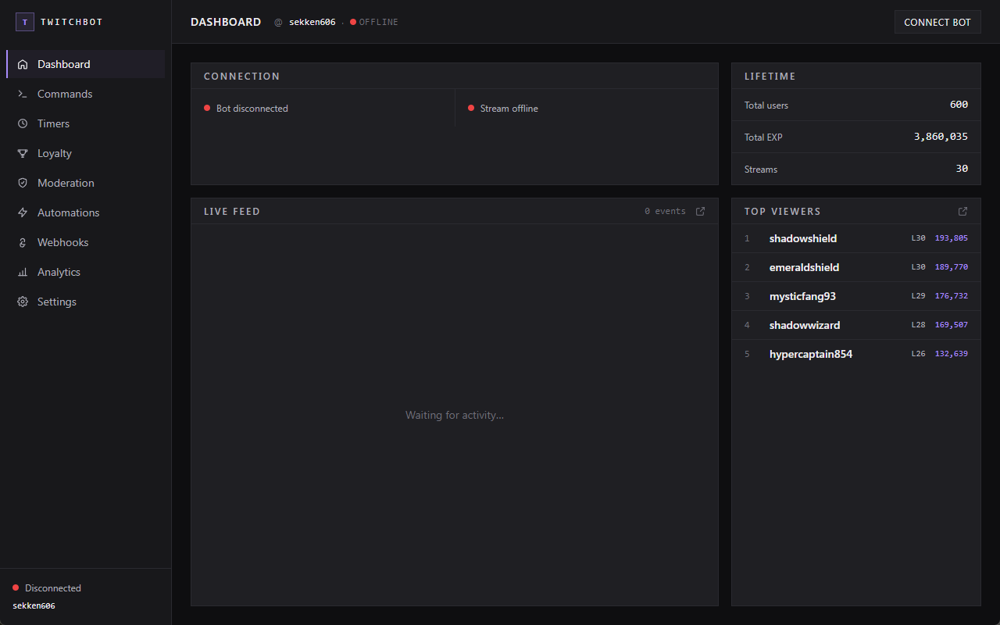
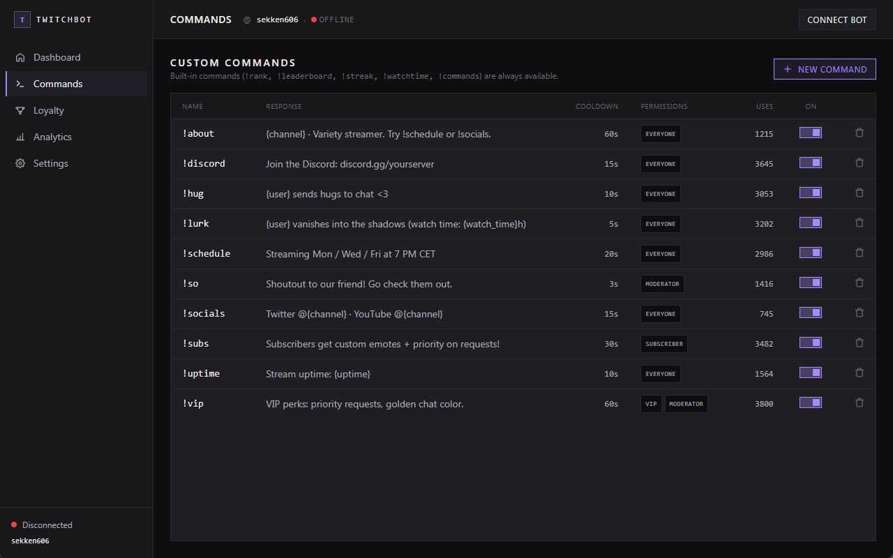
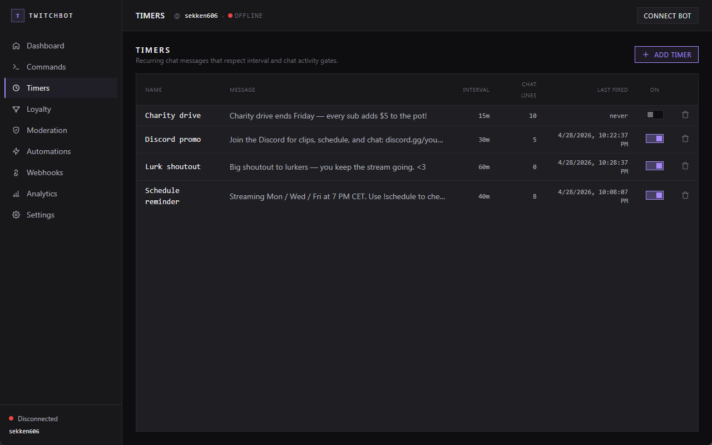
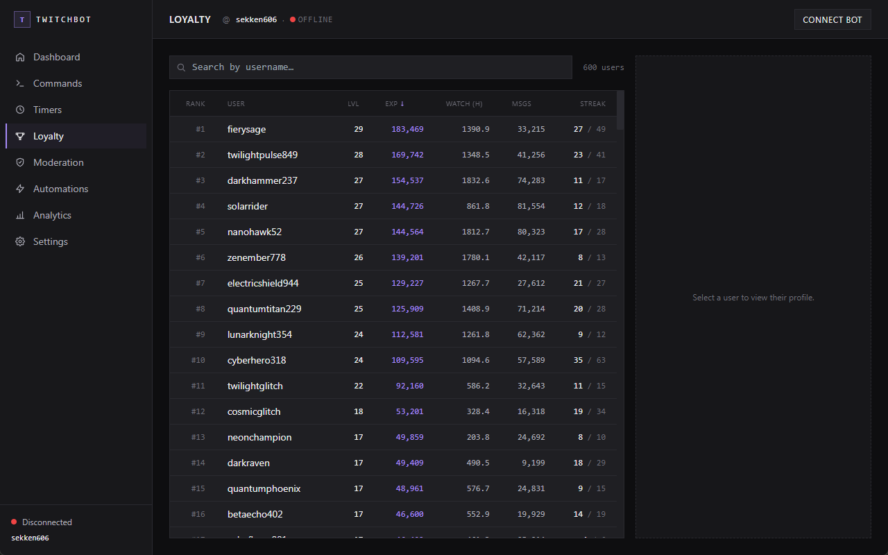
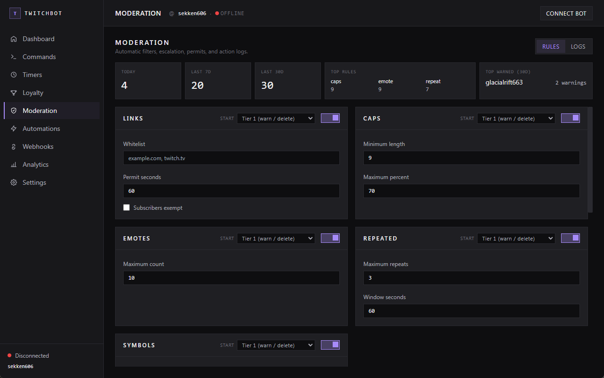
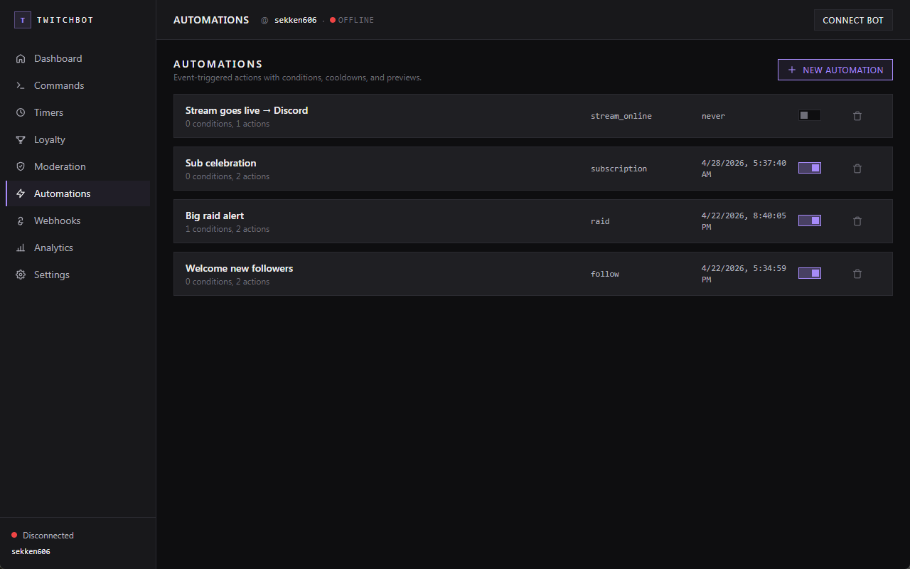
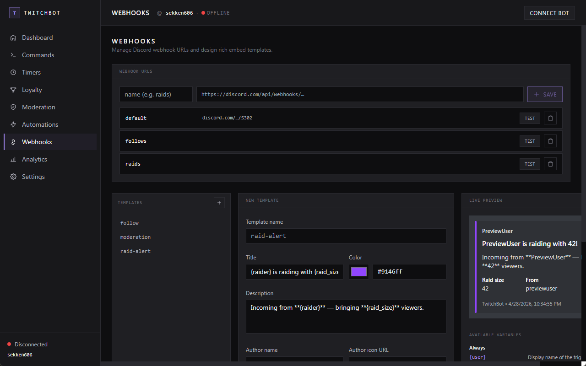
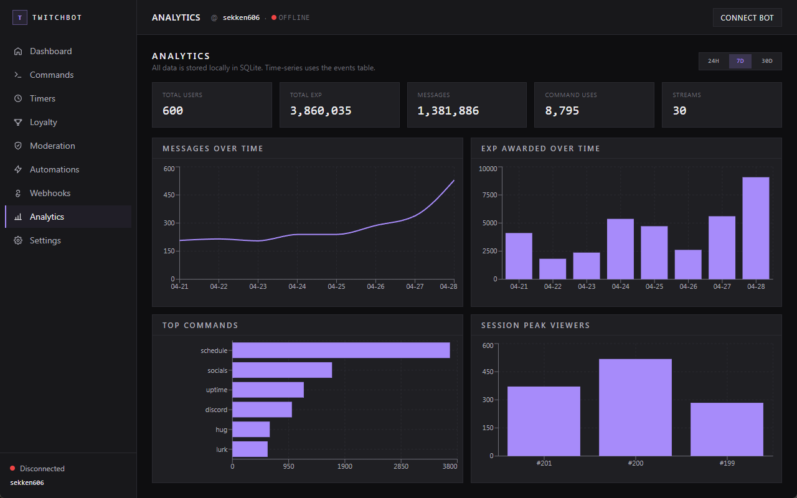
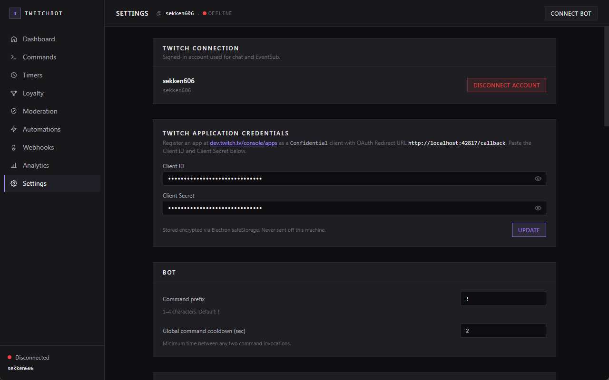

# TwitchBot

**A local Twitch bot with a loyalty system, recurring chat timers, automatic moderation, and an event-driven automation engine — runs on your machine, owns no data but yours.**

Chat commands, EXP and levels, watch streaks, scheduled chat timers, automatic moderation with Helix-backed actions, an automation engine for follows/subs/raids, a live event feed, and a dashboard for the analytics nerd in you. No cloud. No accounts. No subscriptions. Just an app on your PC that talks to Twitch directly.

## Download

Grab the Windows installer (`TwitchBot-x.y.z-setup.exe`) from the
[latest release](https://github.com/sekkedev/twitchbot/releases/latest) —
Windows 10/11, no build tools required. You'll still need your own Twitch
application credentials (see [Getting started](#getting-started), step 1).
Prefer building from source? That's step 2.



---

## What it does

- **Runs your bot.** Connects to your Twitch chat and responds to commands — custom ones you write plus 5 built-ins (`!rank`, `!leaderboard`, `!streak`, `!watchtime`, `!commands`).
- **Sends timed messages.** Recurring chat messages on configurable intervals with enable/disable per timer. Each timer waits for both elapsed time and a configurable amount of chat activity before posting, so the bot stays quiet in an empty room.
- **Moderates chat.** 7 rule types — links, caps, emotes, repeated messages, symbols, blocked words, and first-message screening — with per-rule thresholds and a four-tier auto-escalation ladder (warn → short timeout → medium timeout → long timeout). Each rule has its own start tier override. Permitted users, VIP/sub exemptions, and per-action Discord alerts. Actions go through Twitch's modern Helix endpoints.
- **Triggers event automations.** A rules engine that fires actions on follows, subs, gift subs, cheers, raids, and stream online/offline — chat messages, sounds, Discord webhooks (plain or rich embed), timeouts, EXP bonuses, ordered delays. AND-joined condition filters and per-rule cooldowns; multiple actions per rule.
- **Sends Discord webhooks.** A first-class Webhooks page manages webhook URLs and visual embed templates with a live Discord-style preview. Use them from automations, moderation alerts, or anywhere else you want rich Discord output.
- **Tracks loyalty.** Every viewer who chats accrues EXP, levels up, and builds a watch streak across streams.
- **Shows you what happened.** A live feed mirrors chat + every follow, sub, cheer, raid, and stream event as they happen. Historical data is charted on the Analytics page.
- **Keeps your data yours.** Everything lives in a single SQLite file on your machine. You can export it at any time. Zero telemetry, zero third-party servers.

## Screens

### Commands

Custom responses with variables (`{user}`, `{level}`, `{watch_time}`, …), per-command cooldowns, and set-based permissions (any mix of `everyone`, `follower`, `vip`, `subscriber`, `moderator`).



### Timers

Recurring timed chat messages with the same variable templates as commands. Each timer has an interval (presets: 5/10/15/30/60 min plus custom), enable/disable controls per timer, and an optional minimum number of chat lines that must occur since it last fired — so the bot waits for chatters before posting.



### Loyalty & leaderboard

Sortable, searchable table of every tracked viewer. Click any user to see their profile, full event history, and admin controls (adjust EXP, reset stats).



### Moderation

Seven rule types — **links**, **caps**, **emote spam**, **repeated messages**, **symbol/ASCII spam**, **blocked words** (case-insensitive substring match against your own list), and **first-message screening** (auto-deletes the first chat from any user with no prior messages — useful for catching spam-bot raids). Each rule has its own thresholds and its own **start tier** override, so a rule that should jump straight to a long timeout can do so on the first violation.

The escalation ladder is configurable: tier 1 `delete`/`warn`, tier 2 `timeout 10s`, tier 3 `timeout 10m`, tier 4 `timeout 24h`. Subscribers and VIPs can be exempted globally; specific users can be permitted permanently. Every action is logged to a paginated moderation log you can filter by rule. A stats strip on top shows today / 7-day / 30-day totals, the top three rules firing, and the most-warned user.

Actions use Twitch Helix endpoints (`DELETE /moderation/chat`, `POST /moderation/bans`) — not deprecated IRC commands — and the app warns you when the OAuth token is missing the moderation scopes (`moderator:manage:chat_messages`, `moderator:manage:banned_users`). Optional Discord alerts dispatch a red embed for every action via a webhook of your choosing, using the seeded `moderation` template (editable in the Webhooks page).



### Automations

Event-triggered actions with optional conditions, cooldowns, and a sequenced action list. Supported events: `follow`, `subscription`, `sub_gift`, `cheer`, `raid`, `stream_online`, `stream_offline`. Conditions are AND-joined and use simple operators (`equals`, `greater_than`, `contains`, …) against event payload fields like `viewer_count`, `bits`, `tier`, `is_gift`. Actions:

- `send_chat_message` — with `{user}`, `{raid_size}`, `{raider}`, `{tier_label}`, `{months}`, `{cheer_message}`, etc. variables (16 in total)
- `play_sound` — local files dropped in the in-app sounds directory
- `send_discord_webhook` — references a named webhook from the Webhooks page, optionally with a rich embed
- `timeout_user` — Helix-backed
- `add_exp` — bonus EXP to the triggering user
- `delay` — wait between subsequent actions, max 30s

A **Test** button dry-runs an automation against a mock event payload and shows what would happen before you save.



### Webhooks

A dedicated page for everything Discord. Three sections:

- **Webhook URLs.** Add named webhook URLs (`default`, `raids`, etc.); test each one with a one-click ping; reference them from automations or the moderation alert.
- **Embed template editor.** Build embeds visually — title, description, color picker, author, thumbnail, fields (with inline toggles), footer, timestamp. Templates are stored in settings and addressable by name.
- **Live Discord-style preview.** Renders the embed as Discord shows it as you type, with template variables resolved against mock data so `{raider}`, `{raid_size}`, `{user}`, etc. fill in.

A "Send test" button posts the live embed to whichever webhook you pick. Templates persist across restarts.



### Analytics

Messages over time, EXP awarded per day, top-used commands, and peak viewers across past streams. All four charts update live and support 24h / 7d / 30d ranges.



### Settings

Every knob — EXP per event, level formula, streak rules, the level-up announcement template, every moderation threshold, named Discord webhook URLs, registered sound files — is editable at runtime. Credentials live here too, encrypted on disk.



---

## Quick start

### 1. Register a Twitch application

You need your own app on Twitch (takes 2 minutes) — this app doesn't ship with one because credentials can't safely be shared.

1. Sign in at [dev.twitch.tv/console/apps](https://dev.twitch.tv/console/apps) → **Register Your Application**.
2. Fill in:
   - **OAuth Redirect URL:** `http://localhost:42817/callback` (exact match, port included)
   - **Client Type:** `Confidential`
3. Save, open **Manage**, and copy the **Client ID** and **New Secret**. Keep that tab open.

### 2. Install + launch

Requires Node.js 20+ on Windows 10/11.

```powershell
git clone https://github.com/sekkedev/twitchbot.git
cd twitchbot
npm install
npm run dev
```

### 3. Paste your credentials

On first launch the app shows a credentials form. Paste the Client ID + Client Secret from step 1 and hit **Save**. They're encrypted on disk via Windows' DPAPI (through Electron `safeStorage`) — they never leave your machine and never end up in the git repo.

### 4. Connect

Click **Connect to Twitch**, authorize in the browser, then hit **Connect bot** on the top bar. The live feed starts populating immediately.

If you plan to use the Moderation page, the OAuth flow asks for two extra scopes (`moderator:manage:chat_messages`, `moderator:manage:banned_users`). The Moderation page warns you in-app if any of those scopes are missing — disconnecting and reconnecting re-prompts.

### 5. (Optional) Wire up Discord webhooks

If you want automations or moderation alerts to post to Discord, open the **Webhooks** page, add a named webhook URL (e.g. `default`, `raids`), and reference it by name. The same page has a visual embed-template editor with a live Discord-style preview if you want rich embeds instead of plain text.

---

## Configuration at a glance

Everything below is editable in-app from the Settings page. Changes apply live — no restart.

| Knob | Default | What it does |
|---|---|---|
| `bot_prefix` | `!` | Prefix for commands. 1–4 characters. |
| `exp_per_message` | 3 | EXP per chat message (capped at 30/min per user). |
| `exp_per_minute_watched` | 1 | EXP per minute of presence during a live stream. |
| `exp_per_follow` | 10 | One-time EXP for a first follow from a user. |
| `exp_per_subscribe` | 50 | EXP for a new sub or resub event. |
| `exp_per_gift_sub` | 30 | EXP per sub gifted, credited to the gifter. |
| `exp_per_10_bits` | 1 | EXP scaling for cheers. 100 bits = 10 EXP here. |
| `exp_per_raid_viewer` | 2 | EXP for the channel per viewer in a raid. |
| `streak_bonus_per_stream` | 5 | Bonus EXP per streak length when a streak continues. |
| `streak_minimum_minutes` | 10 | Minutes of chat activity needed to count for the streak. |
| `message_exp_cap_per_minute` | 30 | Per-user cap on chat-EXP/minute (anti-abuse). |
| `global_cooldown_seconds` | 2 | Minimum time between any two command invocations. |
| `level_base` / `level_exponent` | 100 / 1.5 | Level formula: `floor(base × level^exponent)` EXP to level up. |
| `levelup_announcement` | `{user} just reached level {level}!` | Template. Can be disabled entirely. |
| `mod_links_enabled` | `false` | Master toggle for the link filter. |
| `mod_links_whitelist` | empty | Comma-separated allow-listed domains. |
| `mod_links_permit_seconds` | 60 | Duration of a manually granted `!permit`. |
| `mod_links_subs_exempt` | `true` | Subscribers bypass the link filter. |
| `mod_caps_enabled` / `mod_caps_min_length` / `mod_caps_max_percent` | off / 10 / 70 | Caps spam: only check messages ≥N chars, fail if uppercase ratio > N%. |
| `mod_emote_enabled` / `mod_emote_max_count` | off / 10 | Block messages with more than N emotes. |
| `mod_repeat_enabled` / `mod_repeat_max_count` / `mod_repeat_window_seconds` | off / 3 / 60 | Same message N times within N seconds → violation. |
| `mod_symbols_enabled` / `mod_symbols_min_length` / `mod_symbols_max_percent` | off / 10 / 50 | ASCII/symbol spam: same shape as caps but for non-alphanumerics. |
| `mod_vips_exempt` | `false` | VIPs bypass moderation. (Mods + broadcaster always do.) |
| `mod_escalation_1` | `delete` | First-offense action: `delete` or `warn`. |
| `mod_escalation_2_timeout` | 10 | Second-offense timeout, seconds. |
| `mod_escalation_3_timeout` | 600 | Third-offense timeout. |
| `mod_escalation_4_timeout` | 86400 | Fourth-offense timeout (24h). |
| `discord_webhook_*` | empty | Named Discord webhook URLs referenced by automations and moderation alerts. Add/remove from the Webhooks page. |

### Moderation rule toggles

Every rule has an enable toggle and a **start tier** override (1–4). The start tier shifts where on the escalation ladder a user's first violation lands — set it to 3 and the very first offence triggers a tier-3 timeout immediately. Default is 1 (full ladder).

| Setting | Default | What it does |
|---|---|---|
| `mod_links_enabled` | `false` | Block messages containing non-whitelisted links. |
| `mod_caps_enabled` | `false` | Flag messages over the caps threshold. |
| `mod_emote_enabled` | `false` | Flag messages with too many emotes. |
| `mod_repeat_enabled` | `false` | Flag the same message repeated within a window. |
| `mod_symbols_enabled` | `false` | Flag messages with too many non-alphanumeric symbols. |
| `mod_blocked_words_enabled` | `false` | Case-insensitive substring match against `mod_blocked_words` (a JSON array, edited via the Moderation page's tag input). |
| `mod_first_message_screening` | `false` | Delete the first chat from any user with `messages_sent = 0`. Subscribers exempt. |
| `mod_<rule>_start_tier` | `1` | Per-rule starting position on the escalation ladder, integer 1–4. |
| `mod_discord_webhook_enabled` / `mod_discord_webhook_key` | `false` / empty | Dispatch a red embed for every mod action via the named webhook + the seeded `moderation` embed template. |

---

## Developer guide

<details>
<summary><strong>Running the tests</strong></summary>

```powershell
npm run typecheck          # strict TypeScript (main + renderer)
npm test                   # Vitest unit tests — pure logic in electron/lib
npm run lint               # ESLint 9 flat config
npm run test:ipc           # Service-layer integration tests under Electron runtime
npm run build              # Production build
```

CI runs all of the above on every PR — see [.github/workflows/ci.yml](.github/workflows/ci.yml). The Vitest suite (55 unit tests) covers leveling, command logic, and settings validation; the IPC suite (57 integration tests) exercises every service module against a disposable userData database, including the order-of-operations contract between moderation, EXP, and presence tracking. `main` is branch-protected — squash-merge only, linear history, the `Typecheck + test + build` job must be green before merge.

</details>

<details>
<summary><strong>Seeding realistic demo data</strong></summary>

```powershell
# Stop `npm run dev` first — the seeder needs exclusive DB access.
npx electron scripts/seed-db.cjs --size=small    # 120 users, 12 streams, ~2.5k events
npx electron scripts/seed-db.cjs --size=medium   # 600 users, 30 streams, ~12k events
npx electron scripts/seed-db.cjs --size=large    # 1800 users, 60 streams, ~35k events
```

Generates a power-law EXP distribution across a 60-day window plus a handful of timers, moderation warnings, permitted users, and automations so the new pages aren't empty. Wipes generated tables but preserves your settings.

```powershell
npx electron scripts/inspect-db.cjs   # Read-only dump of the current DB
```

</details>

<details>
<summary><strong>Project layout</strong></summary>

```
electron/
  lib/        Pure logic (leveling, permissions, settings validation) — unit-tested
  ipc/        Thin IPC handlers with a { success, data, error } envelope —
              auth, bot, commands, timers, moderation, automations, settings,
              users, sessions, analytics, feed, window, db, credentials, dev
  services/   Stateful: DB, Twitch auth, chat (tmi), EventSub, Helix, EXP,
              streaks, follower cache, timers engine, moderation pipeline,
              automation engine, bot-events bus, feed buffer
  db/         Schema + migrations folder (reserved)
src/
  lib/        Renderer helpers + shared types
  stores/     Zustand store for ambient state (auth, bot, session)
  components/ Sidebar, TopBar, LiveFeed, ErrorBoundary, ConfirmProvider,
              CredentialsCard, NavHotkeys, …
  pages/      One file per route — Dashboard, Commands, Timers, Loyalty,
              Moderation, Automations, Webhooks, Analytics, Settings,
              SignIn, Popout
scripts/      seed-db, inspect-db, test-ipc, capture-screenshots
.github/      CI + release workflows, PR template
```

Sidebar nav order: Dashboard → Commands → Timers → Loyalty → Moderation → Automations → Webhooks → Analytics → Settings.

</details>

<details>
<summary><strong>Architecture notes</strong></summary>

- **No server.** Chat goes over `tmi.js`; events come via Twitch's EventSub WebSocket; metadata + moderation actions hit Helix. The app is only ever a client.
- **Internal event bus.** A typed `bot-events` emitter decouples the chat/EventSub edges from the consumers. Timers, moderation, automations, and EXP all subscribe via `onBotEvent('chat_message' | 'follow' | 'subscription' | 'sub_gift' | 'cheer' | 'raid' | 'stream_online' | 'stream_offline')` without knowing about each other.
- **Moderation pipeline.** Incoming chat goes `upsertUser → handleModeration → (block on violation) → handleMessageExp → presence → command dispatch`. Moderation runs *before* EXP and commands so a deleted message doesn't earn EXP, but *after* the user-row upsert so the viewer-presence FK never fires empty. The order is locked in by the `[presence ordering]` block in the IPC suite.
- **Helix-only mod actions.** Timeouts and message deletions go through `DELETE /moderation/chat` and `POST /moderation/bans` (the modern Helix endpoints). The OAuth flow requests `moderator:manage:chat_messages` and `moderator:manage:banned_users`; the Moderation page surfaces a banner if either scope is missing on the current token.
- **Automation engine.** On boot it loads enabled rules into memory and subscribes to bot-events. On a matching event it evaluates AND-joined conditions, checks the per-rule cooldown, and runs actions sequentially (`delay` is `await`-based, not blocking). A failed action logs but doesn't abort the chain. Hard caps: 10 actions per automation, 20 automations total. CRUD goes through IPC and reloads the in-memory list.
- **Timer engine.** Started by the chat-connected handler, stopped on disconnect. A 15-second tick checks each timer's elapsed time and minimum-chat-lines threshold; the chat-line counter resets per-timer on fire.
- **Secrets encrypted at rest.** OAuth tokens + application credentials use Electron's `safeStorage` (backed by Windows DPAPI / macOS Keychain / libsecret on Linux). No plaintext credentials touch disk.
- **Resilience:** follower lookups cached 15 min; EventSub reconnect silently backfills missed followers via Helix; chat sends rate-limited through an async queue (1 msg/sec, drops oldest on overflow); Helix calls share a rate limiter; Helix `/streams` probe on bot connect recovers state across app restarts; ErrorBoundary wraps the renderer + logs crashes to the main process.
- **Content Security Policy** locked down for packaged builds. Only `id.twitch.tv`, `api.twitch.tv`, the two Twitch WebSockets, and Discord webhook hosts are reachable from the renderer.
- **Keyboard:** `Alt+1` … `Alt+9` jump between sidebar pages in order — Dashboard, Commands, Timers, Loyalty, Moderation, Automations, Webhooks, Analytics, Settings. Used by the screenshot script and handy for manual nav.

</details>

<details>
<summary><strong>Build a distributable installer</strong></summary>

```powershell
npm run build
npx electron-builder --windows
```

Outputs `release/TwitchBot-<version>-setup.exe`. The same workflow runs automatically in CI when a `v*` tag is pushed.

</details>

<details>
<summary><strong>Pop-out windows</strong></summary>

Click the small arrow icon on the Dashboard's **Live feed** or **Top viewers** panel to detach it into its own window. Events stream to every open window independently, so you can keep the feed visible on a second monitor while you work on the rest of the dashboard.

</details>

<details>
<summary><strong>Refreshing the README screenshots</strong></summary>

Production-mode capture, scripted via PowerShell + Win32 interop:

```powershell
npm run build
npx electron scripts/seed-db.cjs --size=medium    # so the new pages have content
Start-Process powershell -ArgumentList '-Command','npx electron .'
.\scripts\capture-screenshots.ps1                 # walks Alt+1..9 for the nine sidebar pages
```

The script captures only the client area (no title bar) at 1280×800 and saves PNGs into `docs/screenshots/`.

</details>

---

## Contributing

Bug reports and PRs welcome. The project follows the [Conventional Commits](https://www.conventionalcommits.org/) format and uses issue-linked branches (`feat/<issue>-<slug>`). Before opening a PR:

```powershell
npm run lint
npm run typecheck
npm test
npm run test:ipc
```

CI will run the same checks, so it's worth doing locally first.

## License

[MIT](LICENSE) — do whatever you want, just don't sue anyone.

---

<sub>Local Windows desktop Twitch bot with loyalty/EXP, custom commands, chat timers, auto-moderation, event-driven automations, and an in-app dashboard. Electron + React + TypeScript.</sub>
